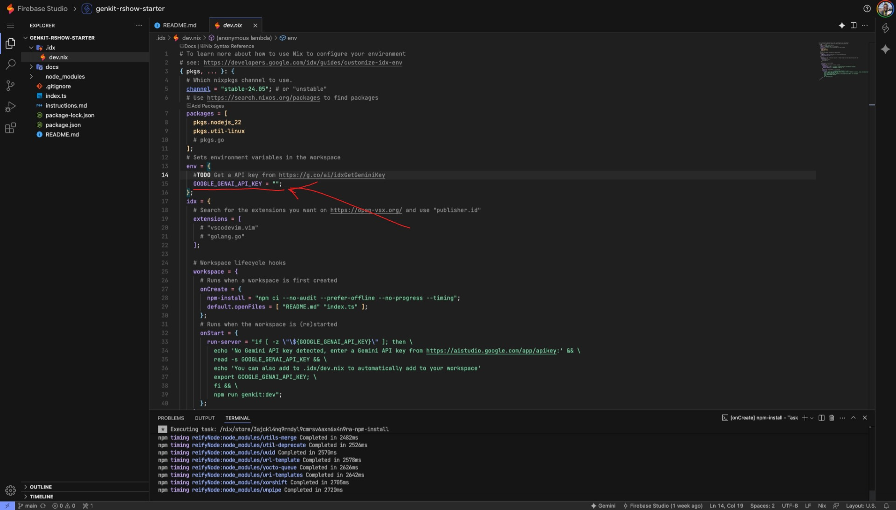
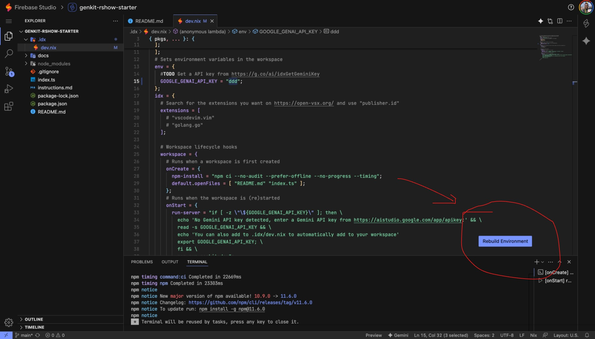

author: Maina Wycliffe, Wayne Gakuo
summary: Learn how to build AI applications with Genkit
id: docs
categories: ai,firebase,genkit
environments: Web
status: Published
feedback link: https://github.com/unstacked-labs/genkit-rshow-starter/issues

# Google AI Roadshow - Genkit Hands-on Workshop

## Overview

In this hands-on codelab, you'll learn how to build AI-powered applications using **Firebase Genkit**. We'll create a fun "GitHub Roaster" application that uses AI to analyze a developer's GitHub profile and generate witty commentary about their coding habits.

_This workshop is brought to you by [Unstacked Labs](https://unstacked.dev) - empowering developers across Africa with cutting-edge technology._

**What you'll learn:**

- How to set up and configure Genkit with Google AI
- Creating type-safe data schemas with Zod
- Building AI tools that can fetch external data
- Implementing AI flows that orchestrate multiple operations
- Using Genkit's streaming capabilities for real-time responses

**What you'll build:**

A GitHub profile analyzer that:

- Fetches repository data from the GitHub API
- Analyzes commit patterns and project activity
- Generates entertaining roasts using Google's Gemini AI
- Streams responses in real-time

**Prerequisites:**

- Basic knowledge of TypeScript/JavaScript
- Familiarity with REST APIs
- A GitHub account
- A Google account for AI Studio access

Duration: 45-60 minutes

---

## Import the Project into Firebase Studio

1. Open [Firebase Studio](https://firebase.studio/)
2. Click **Try Firebase Studio**
3. Click **Import Repo**
4. Paste this repo link:  
   `https://github.com/unstacked-labs/genkit-rshow-starter`
5. Name the workspace **genkit-starter**
6. Click **Import**

[](images/firebase_studio.gif)

---

## Get Your Google AI Studio API Key

1. Open [Google AI Studio](https://aistudio.google.com/)
2. Generate an API Key (any project is fine)
3. Copy the API key


---

## Add the API Key to Your Project

1. In Firebase Studio, open the **dev.nix** file inside the **.idx** folder.
2. Find the `env` section and add your API key:

```nix
env = {
  # TODO Get an API key from https://g.co/ai/idxGetGeminiKey
  GOOGLE_GENAI_API_KEY = "AI STUDIO KEY HERE";
};
```



1. Save the file.

Positive
: Rebuild the environment when prompted (should appear at the bottom right after saving the API key).



---

## Step 4: Install Dependencies

In the terminal, run:

```sh
npm install
```

---

## Set Up Imports and Initialize Genkit

First, let's examine how we import and initialize Genkit with the Google AI plugin.

1. Open the `index.ts` file in your workspace
2. Review the following imports and initialization code:

```ts
import { gemini20Flash, googleAI } from '@genkit-ai/googleai';
import { genkit, z } from 'genkit';

// Initialize Genkit with the Google AI plugin and set a default model.
const ai = genkit({
  plugins: [googleAI()],
  model: gemini20Flash,
});
```

Positive
: This setup gives us access to Google's Gemini models through Genkit's unified AI interface.

---

## Define Data Schemas with Zod

Next, we'll create type-safe data structures using Zod schemas. These ensure our data from the GitHub API is properly validated.

1. Add the repository schema for GitHub repository data:

```ts
// Zod schema for a GitHub repository's relevant data.
const repoSchema = z.object({
  name: z.string(),
  language: z.string().nullable(),
  pushed_at: z.string(),
  stargazers_count: z.number(),
  forks: z.number(),
});
```

2. Add the GitHub event schema for commit data:

```ts
// Zod schema for a single GitHub event.
const githubEventSchema = z.object({
  id: z.string(),
  type: z.string(),
  repo: z.object({
    id: z.number(),
    name: z.string(),
    url: z.string(),
  }),
  payload: z.object({
    commits: z
      .array(
        z.object({
          sha: z.string(),
          author: z.object({
            email: z.string(),
            name: z.string(),
          }),
          message: z.string(),
          distinct: z.boolean(),
          url: z.string(),
        }),
      )
      .optional(),
  }),
});

// Zod schema for an array of GitHub events.
const githubEventsArraySchema = z.array(githubEventSchema);
```

Note: Zod schemas provide runtime type validation and excellent TypeScript integration, ensuring data integrity throughout your application.

---

## Create the GitHub Repositories Tool

Now we'll create our first Genkit tool that fetches GitHub repository data.

1. Add the `fetchGithubRepos` tool:

```ts
const fetchGithubRepos = ai.defineTool(
  {
    name: 'fetchGithubRepos',
    description:
      'Fetches a list of public repositories for a given GitHub username sorted by pushed date (recently updated).',
    // Input validation using Zod
    inputSchema: z.object({ username: z.string() }),
    // Output validation using Zod
    outputSchema: z.array(repoSchema),
  },
  async ({ username }) => {
    console.log(`Fetching repos for ${username}`);
    const response = await fetch(
      // Fetch the last 15 repos sorted by pushed date
      `https://api.github.com/users/${username}/repos?sort=pushed&per_page=15`,
      {
        headers: {
          Accept: 'application/vnd.github.v3+json',
          'User-Agent': 'Genkit-Repo-Roaster-Agent', // GitHub requires a User-Agent
        },
      },
    );

    if (!response.ok) {
      throw new Error(`Failed to fetch repos from GitHub: ${response.statusText}`);
    }

    const repos = await response.json();
    const reposParsed = z.array(repoSchema).parse(repos);

    // Return only the properties we need
    return reposParsed.map((repo) => ({
      name: repo.name,
      language: repo.language,
      pushed_at: repo.pushed_at,
      stargazers_count: repo.stargazers_count,
      forks: repo.forks,
    }));
  },
);
```

Note: **Important**: Tools are functions that the AI can call autonomously to gather information. The AI decides when and how to use them based on the tool's description.

---

## Create the Commit Messages Tool

Our second tool will fetch commit messages from a user's recent GitHub activity.

1. Add the `fetchCommitMessages` tool:

```ts
const fetchCommitMessages = ai.defineTool(
  {
    name: 'fetchCommitMessages',
    description: 'Fetches commit messages from the last 100 events of a GitHub user.',
    inputSchema: z.object({
      owner: z.string(),
    }),
    outputSchema: z.array(z.string()),
  },
  async ({ owner }) => {
    const response = await fetch(
      `https://api.github.com/users/${owner}/events?per_page=100`, // Fetch the last 100 events
      {
        headers: {
          Accept: 'application/vnd.github.v3+json',
          'User-Agent': 'Genkit-Repo-Roaster-Agent',
        },
      },
    );

    if (!response.ok) {
      throw new Error(`Failed to fetch commit messages from GitHub: ${response.statusText}`);
    }

    const commits = await response.json();
    const commitsParsed = githubEventsArraySchema.parse(commits);

    return (
      commitsParsed
        // Filter for PushEvent type and extract commit messages
        .filter((event) => event.type === 'PushEvent')
        .map((commit) => commit.payload.commits?.map((c) => c.message))
        .flat()
        .filter((commit) => commit !== undefined) as string[]
    );
  },
);
```

Positive: This tool extracts commit messages from GitHub's events API, giving the AI insight into a developer's commit history.

---

## Create the Main Flow

Finally, we'll create the main flow that orchestrates everything together.

1. Add the `githubGrillerFlow` that combines our tools with AI generation:

```ts
const githubGrillerFlow = ai.defineFlow(
  {
    name: 'githubGrillerFlow',
    inputSchema: z.object({
      username: z.string(),
    }),
    outputSchema: z.string(),
  },
  async ({ username }, streamCallback) => {
    const { response, stream } = ai.generateStream({
      prompt: `
        You are a witty, sarcastic, and expert code reviewer. Your name is "Ripper - The Roast master".
        Your task is to write a short, funny roast of a developer based on their public GitHub repositories.
        Be playful and clever, not truly mean (but also, don't hold back).
        
        Here's the username for the user "${username}".
        
        Using the provided tools, you will fetch their GitHub repositories and commit messages, 
        and then roast them based on their activity.
        
        Roast them! Consider these angles:
        - Too many unfinished projects (look at the 'pushed_at' dates).
        - Sticking to only one language (e.g., "Ah, another JavaScript connoisseur").
        - Weird or unoriginal repository names.
        - A graveyard of forked repos with no original work.
        - A complete lack of stars.
        
        You only have one task: roast the developer based on their GitHub activity and nothing else.
        Return the roast as a single string, no other text or explanation needed.
      `,
      /* 

        Please note the tools being used here are crucial for fetching the necessary data to inform the AI's response.

      */
      tools: [fetchGithubRepos, fetchCommitMessages],
      config: {
        temperature: 0.8, // Higher temperature for more creative responses
      },
    });

    // Stream the response back to the client
    for await (const chunk of stream) {
      streamCallback(chunk);
    }

    const { text } = await response;
    console.log({ text });
    return text;
  },
);
```

Note: **Flow Architecture**: Flows orchestrate multiple AI calls and tool usage. They can stream responses in real-time and handle complex multi-step AI interactions.

---

## Run and Test the Project

Now let's run the Genkit Developer UI to test our GitHub Roaster application.

1. In the terminal, start the Genkit development server:

```sh
npx genkit start -- npx tsx --watch index.ts
```

2. Click on the link provided in the terminal (usually `http://localhost:4000`)

3. In the Genkit Developer UI:

   - Navigate to the **Flows** section
   - Find the `githubGrillerFlow`
   - Click on it to open the flow tester

4. Test the flow:

   - Enter a GitHub username in the input field (try your own or `octocat`)
   - Click **Run Flow**
   - Watch as the AI streams its roast in real-time!

5. Explore the **Tools** section to see how individual tools work:
   - Test `fetchGithubRepos` with different usernames
   - Try `fetchCommitMessages` to see commit history analysis

Note: **Developer UI Features**: The Genkit Developer UI provides powerful debugging capabilities, allowing you to test flows, inspect tool outputs, and monitor AI interactions in real-time.

Note: **Rate Limiting**: Be mindful of GitHub's API rate limits when testing. Unauthenticated requests are limited to 60 per hour per IP address.

---

## Congratulations!

You've successfully built an AI-powered GitHub analysis application using Firebase Genkit!

**What you accomplished:**

- ✅ Set up Genkit with Google AI integration
- ✅ Created type-safe data schemas with Zod
- ✅ Built custom AI tools for external API integration
- ✅ Implemented a streaming AI flow
- ✅ Tested your application with the Genkit Developer UI

**Next Steps:**

- Try modifying the roast prompt for different personalities
- Add more GitHub API endpoints like Github Profile Info, so it can use the user's name and bio in the roast
- Add more GitHub API endpoints (issues, pull requests, etc.)
- Deploy your application to Firebase Functions
- Explore other Genkit plugins and models

---

## Resources and Connect With Us

### 📚 Workshop Resources

- **GitHub Repository**: [genkit-rshow-starter](https://github.com/unstacked-labs/genkit-rshow-starter)
- **Firebase Genkit Documentation**: [Official Docs](https://firebase.google.com/docs/genkit)
- **Google AI Studio**: [aistudio.google.com](https://aistudio.google.com/)

### 🤝 Connect With the Authors

**Maina Wycliffe**

- 💼 LinkedIn: [Maina Wycliffe](https://linkedin.com/in/mainawycliffe)
- 🐙 GitHub: [@mainawycliffe](https://github.com/mainawycliffe)

**Wayne Gakuo**

- 🐦 Twitter: [@wayne_gakuo](https://x.com/wayne_gakuo)
- 💼 LinkedIn: [Wayne Gakuo](https://www.linkedin.com/in/waynegakuo/)
- 🐙 GitHub: [@waynegakuo](https://github.com/waynegakuo)

---

Happy coding! 🚀
